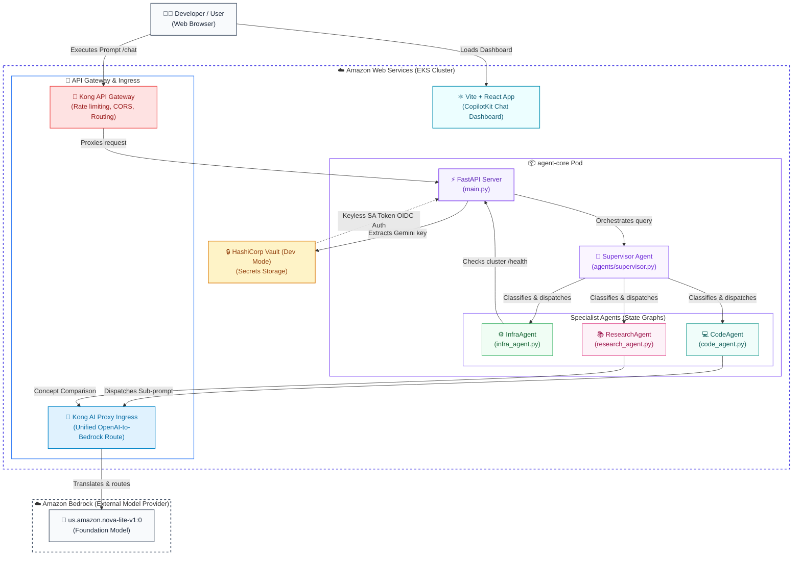

# AgentInfra: Stateful Multi-Agent EKS Platform

AgentInfra is an enterprise-grade, stateful AI agent platform deployed on **Amazon EKS**. It features a **LangGraph Multi-Agent Supervisor** architecture, keyless authentication controls via **HashiCorp Vault**, API governance via the **Kong AI Ingress Gateway**, and a premium **React + CopilotKit** developer dashboard.

---

## 🏗️ System Architecture

### Container Level (C4 Container View)



---

## 💡 Key Design Decisions & Rationale

### 1. LangGraph Multi-Agent Supervisor Pattern
* **Context**: A single monolithic agent handling EKS commands, capability queries, and research explanations suffers from "tool-confusion" and high token latency.
* **Decision**: We implemented an **Orchestrator-Specialist** design using LangGraph. The `SupervisorAgent` runs a fast routing classifier (at `temperature=0.0`) and hands off the user prompt context to domain-specific specialists (`InfraAgent`, `CodeAgent`, or `ResearchAgent`). Each specialist controls its own tools and execution sub-graph, keeping contexts small and modular.

### 2. Keyless Secrets Management (EKS OIDC + Vault SA Identity)
* **Context**: Hardcoding administrative tokens or Gemini API keys in Git configurations compromises system security.
* **Decision**: The backend `agent-core` pod authenticates to **HashiCorp Vault** keylessly. We bound the pod's `agent-core-sa` Kubernetes ServiceAccount to Vault's role using Kubernetes OIDC tokens. At startup, the agent retrieves the Gemini API key from Vault memory dynamically, avoiding any static local env-file storage.

### 3. Kong AI Gateway Proxying for AWS Bedrock
* **Context**: Direct calls to Google AI Studio from cluster nodes frequently face Free-Tier IP blockages and strict rate limits.
* **Decision**: We deployed a Kong Ingress proxy configured with the `ai-proxy` plugin. This exposes an OpenAI-compatible endpoint locally, wraps outbound requests securely using EKS node-attached IAM access credentials, and forwards them keylessly to **Amazon Bedrock (Nova Lite)**.

### 4. Rich Dashboard with Visual Specialist Logs
* **Context**: Standard chat feeds fail to capture "multi-agent" reasoning paths, leaving the user blind to subagent executions.
* **Decision**: We added custom JSON fields in the FastAPI chat payload to carry the supervisor's active `specialist` metadata and the agent's chain-of-thought. The React frontend intercepts the payload and renders:
  1. A **collapsible reasoning details drawer** showing agent reasoning processes.
  2. A **specialist badge** indicating which sub-agent performed the task.

---

## 🚀 Bootstrap & Setup Playbook

### Prerequisite Checks
1. Ensure your AWS credentials are loaded (`aws sts get-caller-identity`).
2. Ensure `colima` is running (`colima status`) to provide container sockets.

### Complete Deployment Chain
Spin up the platform in order using the automated `Makefile` targets:

```bash
# 1. Spin up AWS VPC, EKS Cluster, and local kubeconfig (takes 15-20 mins)
make bootstrap

# 2. Deploy Vault and Kong Gateways into the cluster via Helm
make deploy-security

# 3. Enter your Google Gemini API key securely when prompted
make write-secret

# 4. Bind EKS Kubernetes ServiceAccount identities in Vault auth policies
make configure-vault-auth

# 5. Connect EKS node policies and Kong ai-proxy to AWS Bedrock
make configure-bedrock-auth

# 6. Compile and push the multi-agent container to AWS ECR
make build-and-push

# 7. Roll out the agent core deployment and restart pods to boot the supervisor
make deploy-agent
```

### Running the Frontend
To launch the React dashboard locally:
```bash
cd frontend
npm install
npm run dev
```
Open `http://localhost:5173/` in your browser.

---

## 🧹 Tear-down & Resource Cleanup

To prevent idle AWS charges when your session completes:
```bash
make teardown
```

---

## 📂 Code Layout
```
├── app/
│   ├── agents/            # Specialist Agents & Supervisor logic
│   │   ├── infra_agent.py # EKS health/status diagnostic tools
│   │   ├── code_agent.py  # Introspection & sub-prompt execution
│   │   ├── research_agent.py # Multi-hop knowledge comparison tools
│   │   └── supervisor.py  # Intent router & orchestrator
│   ├── agent.py           # Thin entry shim re-exporting supervisor
│   ├── main.py            # FastAPI service exposing /chat & /health
│   ├── vault_client.py    # Keyless secrets lookup client
│   └── requirements.txt   # Python dependency declarations
├── frontend/
│   ├── src/
│   │   ├── App.jsx        # Dashboard logic, markdown renderers
│   │   └── index.css      # Dark-theme design tokens & glassmorphism
├── infra/
│   ├── terraform/         # VPC, EKS, Node groups, and IAM policies
│   ├── k8s/               # Kubernetes Deployment and Service specs
│   └── helm/              # Helm configuration values for Vault and Kong
└── Makefile               # Core operations automation recipes
```
