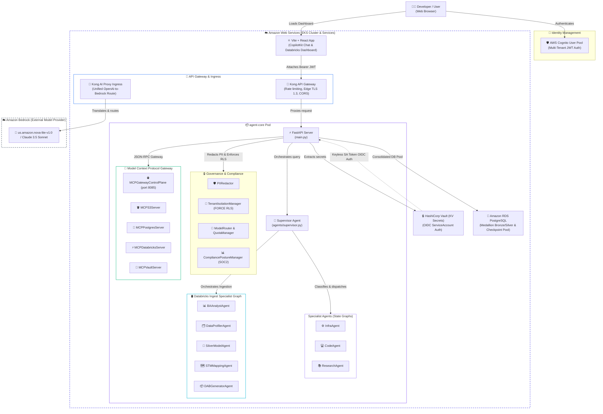

# AgentInfra: Stateful Multi-Agent EKS Platform

AgentInfra is an enterprise-grade, stateful AI agent platform deployed on **Amazon EKS**. It features a **LangGraph Multi-Agent Supervisor** architecture, keyless authentication controls via **HashiCorp Vault**, API governance via **Kong AI Ingress Gateway (TLS 1.3)**, Model Context Protocol (MCP) gateway control plane, multi-tenant Row-Level Security (RLS), and a **React + CopilotKit** developer dashboard.

---

## 🏗️ System Architecture

### Container Level (C4 Container View)



---

## 💡 Key Design Decisions & Rationale

### 1. LangGraph Multi-Agent Supervisor Pattern
* **Context**: A single monolithic agent handling EKS commands, capability queries, and research explanations suffers from "tool-confusion" and high token latency.
* **Decision**: We implemented an **Orchestrator-Specialist** design using LangGraph. The `SupervisorAgent` runs a fast routing classifier (at `temperature=0.0`) and hands off user prompt context to domain-specific specialists (`InfraAgent`, `CodeAgent`, `ResearchAgent`, or the 5-node `DatabricksPipelineGraph`).

### 2. Keyless Secrets Management (EKS OIDC + Vault SA Identity)
* **Context**: Hardcoding administrative tokens or Gemini API keys in Git configurations compromises system security.
* **Decision**: The backend `agent-core` pod authenticates to **HashiCorp Vault** keylessly. We bound the pod's `agent-core-sa` Kubernetes ServiceAccount to Vault's role using Kubernetes OIDC tokens. At startup, the agent retrieves credentials from Vault memory dynamically, avoiding any static local env-file storage.

### 3. PostgreSQL Row-Level Security & PII Redaction
* **Context**: Multi-tenant data isolation and data privacy compliance require strict table-level and payload-level boundaries.
* **Decision**: `TenantIsolationManager` ([app/tenant_governance.py](file:///Users/avikaushik/agentinfra/app/tenant_governance.py)) enforces `ENABLE ROW LEVEL SECURITY` and `FORCE ROW LEVEL SECURITY` on all target PostgreSQL tables, setting tenant context via `SET LOCAL app.current_tenant`. Prompt payloads are pre-sanitized by `PIIRedactor` before model invocation.

### 4. Consolidated Database Connection Pooling
* **Context**: High-concurrency agent workflows spawning separate connection pools per graph instance quickly exhaust PostgreSQL database connections under Horizontal Pod Autoscaler (HPA) scale-out.
* **Decision**: Implemented `get_shared_postgres_pool()` in [app/db.py](file:///Users/avikaushik/agentinfra/app/db.py) which manages a single thread-safe `ConnectionPool` per pod, used across both `SupervisorAgent` and `DatabricksPipelineGraph` checkpointers.

### 5. Model Context Protocol (MCP) Enterprise Gateway
* **Context**: Decoupling LLM tool invocation from underlying infrastructure services requires a unified, role-gated protocol standard.
* **Decision**: Built `MCPGatewayControlPlane` ([app/mcp_gateway.py](file:///Users/avikaushik/agentinfra/app/mcp_gateway.py)) exposing JSON-RPC tool endpoints backed by dedicated FastMCP servers for S3 (`MCPS3Server`), PostgreSQL (`MCPPostgresServer`), Databricks (`MCPDatabricksServer`), and Vault (`MCPVaultServer`).

---

## 🚀 Bootstrap & Setup Playbook

### Prerequisite Checks
1. Ensure your AWS credentials are active (`aws sso login --profile agent-dev`).
2. Ensure `colima` is running (`colima start --cpu 4 --memory 8`) to provide container sockets.

### Complete Deployment Chain
Spin up the platform using the automated `Makefile` targets:

```bash
# 1. Spin up AWS VPC, EKS Cluster, RDS Postgres, and local kubeconfig (takes ~15 mins)
make bootstrap

# 2. Deploy Vault and Kong Gateways into the cluster via Helm
make deploy-security

# 3. Bind EKS Kubernetes ServiceAccount identities in Vault auth policies
make configure-vault-auth

# 4. Connect EKS node policies and Kong ai-proxy to AWS Bedrock
make configure-bedrock-auth

# 5. Write RDS & Cognito secrets into Vault KV engine
# (automatically extracted from Terraform outputs)

# 6. Upload raw JSON sample assets to S3 landing bucket
make upload-samples

# 7. Compile and push the multi-agent container to AWS ECR
make build-and-push

# 8. Roll out the agent core deployment and restart pods to boot the supervisor
make deploy-agent
```

### Running the Frontend
To launch the React dashboard locally:
```bash
cd frontend
npm install
npm run dev
```
Open `http://localhost:5173/` in your browser.

---

## 🧹 Tear-down & Resource Cleanup

To prevent idle AWS charges when your session completes:
```bash
make teardown
```

`make teardown` executes the safe multi-stage sequence:
`pre-teardown` (drains K8s LoadBalancers) → `purge-orphans` (deletes dangling ELBs/SGs) → `terraform destroy` → `make clean`.

---

## 📂 Code Layout
```
├── app/
│   ├── agents/            # Specialist Agents & Supervisor logic
│   │   ├── infra_agent.py # EKS health/status diagnostic tools
│   │   ├── code_agent.py  # Introspection & sub-prompt execution
│   │   ├── research_agent.py # Multi-hop knowledge comparison tools
│   │   ├── ba_analyst_agent.py # Business Analyst value stream parser
│   │   ├── data_profiler_agent.py # Delta Bronze profiler specialist
│   │   ├── silver_model_agent.py # IBM BDW Conformance specialist
│   │   ├── stm_mapping_agent.py # Source-to-Target mapping generator
│   │   ├── dab_generator_agent.py # DAB Bundle compiler specialist
│   │   └── supervisor.py  # Intent router & orchestrator
│   ├── agent.py           # Thin entry shim re-exporting supervisor
│   ├── main.py            # FastAPI service exposing REST & SSE endpoints
│   ├── db.py              # Consolidated singleton connection pool
│   ├── contracts.py       # Pydantic contract definitions
│   ├── validator.py       # Deterministic pipeline validator
│   ├── canonical_store.py # IBM BDW canonical model vector store
│   ├── tenant_governance.py # PII Redactor & Row-Level Security manager
│   ├── model_router.py    # Dynamic LLM routing, cost & quota manager
│   ├── compliance_manager.py # SOC2 compliance posture auditor
│   ├── lineage_viewer.py  # Field-level lineage graph service
│   ├── document_parser.py # BRD requirements parser
│   ├── mcp_gateway.py     # MCP JSON-RPC control plane
│   ├── mcp_s3_server.py   # FastMCP S3 server
│   ├── mcp_postgres_server.py # FastMCP PostgreSQL server
│   ├── mcp_databricks_server.py # FastMCP Databricks server
│   ├── mcp_vault_server.py # FastMCP Vault server
│   └── requirements.txt   # Python dependency declarations
├── frontend/
│   ├── src/
│   │   ├── App.jsx        # Dashboard logic, markdown renderers, Databricks tab
│   │   └── index.css      # Dark-theme design tokens & glassmorphism
├── infra/
│   ├── terraform/         # VPC, EKS, Node groups, RDS, Cognito, IAM policies
│   ├── k8s/               # Kubernetes Deployments, Services, HPA, PDB, MCP specs
│   └── helm/              # Helm configuration values for Vault and Kong
├── handoff/
│   └── handoff.md         # Current status handoff document
├── memories/
│   ├── implementation.md # Full architecture roadmap & phase log
│   └── poc_architecture.md # Core architectural principles & SOLID patterns
└── Makefile               # Core operations automation recipes
```
