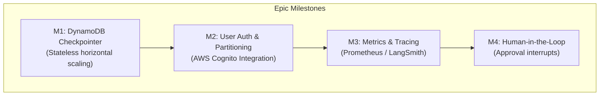

# Epic: Multi-Tenant State Security & Production Architecture

This epic outlines the specifications, technical designs, and deployment milestones for the next 4 priority improvements on the Stateful EKS Agent Infrastructure.

## 1. Problem Statement
The current prototype runs completely in-memory using LangGraph's local `MemorySaver` checkpointer. This design is state-bound to a single backend pod, meaning any scaling actions, pod restarts, or rolling updates will wipe the checkpointer state and erase developer chat histories. Furthermore, there is no user authentication, tracing instrumentation, or protective guardrails for infrastructure modification actions.

---

## 2. Upgrade Roadmap & Implementation Plan

### 🧱 Milestone 1: AWS RDS PostgreSQL Checkpointer Backing
* **Product Goal**: Enable horizontal pod autoscaling (HPA) and failover recovery by moving chat memory to a centralized PostgreSQL database.
* **Technical Effort**:
  1. **Provisioning**: Update EKS Terraform scripts in `infra/terraform/` to provision an Amazon RDS PostgreSQL database instance inside the VPC.
  2. **Code Integration**: Add `langgraph-checkpoint-postgres` and `psycopg[binary]` to `requirements.txt`.
  3. **Backend Update**: Replace the local in-memory `MemorySaver` checkpointer in [supervisor.py](file:///Users/avikaushik/agentinfra/app/agents/supervisor.py) with a `PostgresSaver` connection pool manager.
  4. **Security**: Store the database passwords and credentials securely inside HashiCorp Vault. Configure the agent pod to retrieve these keys keylessly via Kubernetes auth.

### 🔐 Milestone 2: Cognito User Authentication & Data Isolation
* **Product Goal**: Authenticate developer logins and ensure strict data isolation so users can only access their personal chat threads.
* **Technical Effort**:
  1. **IAM Pool**: Deploy an AWS Cognito User Pool via Terraform and obtain client IDs.
  2. **Kong JWT Gateway validation**: Attach Kong's `jwt` plugin to the `/chat/stream` ingress path in `ai-gateway.yaml`. Kong will intercept incoming browser queries, authenticate the JWT bearer signature, and inject `X-User-ID` headers to the downstream backend.
  3. **Database Partitioning**: Add a `user_id` attribute to state threads, validating that the incoming `session_id` belongs to the requesting developer before returning records.
  4. **Frontend Login**: Integrate the Cognito OAuth2 client SDK inside `App.jsx` to load token headers dynamically.

### 📊 Milestone 3: Metrics & Observability Instrumentation
* **Product Goal**: Real-time operational visibility into model costs, specialist routing distributions, and tool execution success rates.
* **Technical Effort**:
  1. **LangSmith Integration**: Register a LangSmith API key secret inside HashiCorp Vault. Enable tracing on the supervisor graph via callbacks when Vault flags are present.
  2. **Prometheus Gauges**: Add a `/metrics` Prometheus endpoint to FastAPI. Increment counters for:
     - `agent_routing_total{specialist="INFRA|CODE|RESEARCH"}`
     - `llm_token_count{model="nova-lite", direction="inbound|outbound"}`
  3. **Grafana Dashboard**: Import a custom Grafana dashboard tracking pod performance, routing frequency, and model billing metrics.

### 🛡️ Milestone 4: Human-in-the-Loop Approval Workflows
* **Product Goal**: Enforce review boundaries on actions that modify infrastructure state (e.g. running destructive commands).
* **Technical Effort**:
  1. **Graph Interruption**: Refactored subagent graphs (e.g. `InfraAgent`) using LangGraph's `interrupt_before=["tools"]` configuration.
  2. **Halt State**: If the supervisor routes to a state-modifying action (e.g. `execute_kubectl_delete`), the backend suspends graph execution and returns an SSE `approval_required` event payload.
  3. **Approval Card**: The React frontend intercepts the event and renders a card blocking the UI with "Confirm Exec" and "Cancel" buttons.
  4. **Resume Route**: Clicking "Confirm" calls `POST /chat/approve`, which resumes the graph execution with the approved flag context.
